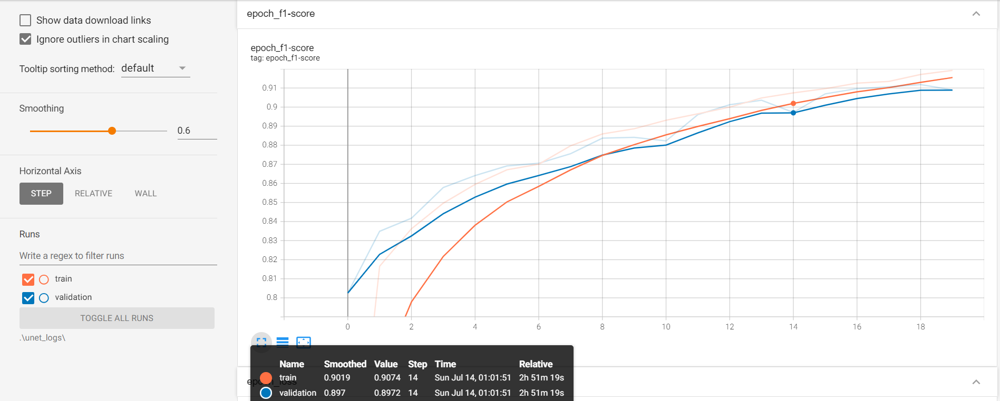
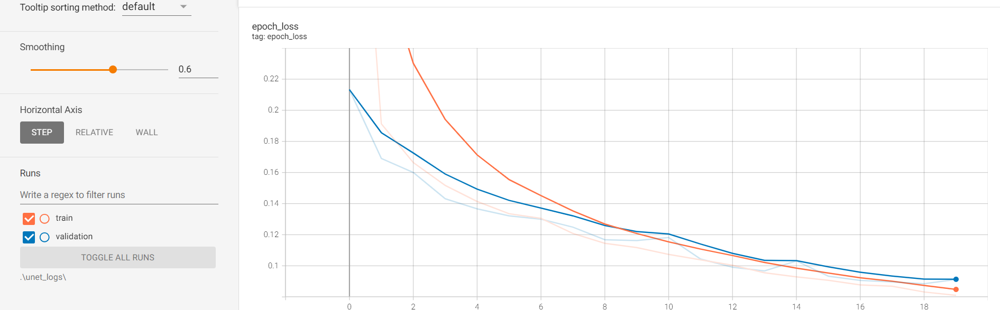

# Airbus Ship Detection

## Model Architecture
The solution involves assembling models, including using ResNet50 to classify images for ship presence. For segmentation purposes, the `segmentation_models` library was utilized, selecting U-Net with a ResNet50 pretrained backbone.

## Metrics and Loss Function
For this project, I used the F1 score(in this case analgoy to Dice score) as metrics, and Dice Loss as the loss function. The Dice Coefficient isparticularly effective for evaluating segmentation models as they consider the overlap between the predicted and ground truth masks, providing a more accurate measure of the model's performance in segmentation tasks. Dice Loss was chosen as it is directly related to the Dice Coefficient, helping to optimize the model for better overlap between predicted and actual segmentation masks.

## ResNet50 training
For training this model was used dataset of total 85112 samples, 68089 for training 17023 for validation.
In both validation and training datasets data was equally representable(50% images with ships and 50% without)

## Hyperparameter Tuning for ResNet50
- **Learning Rate (LR):** 7e-5
- **Batch Size:** 8
- **Epochs:** 10

## Unet training
For training this model i used dataset that consisted only of samples with ships. Dataset consists of 42556 samples - 34044 for training and 8512 for validation.

## Hyperparameter Tuning for Unet
- **Learning Rate (LR):** 6e-5
- **Batch Size:** 16
- **Epochs:** 20

## Unet training plots
### F1-Score 

### Dice Loss

## Metrics
- **val-f1-score:** 0.9118
- **val_loss:** 0.0885

## Current Results in Kaggle
- **Public score:** 0.52090
- **Private score:** 0.76566